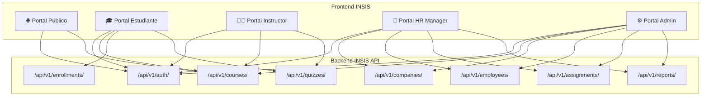
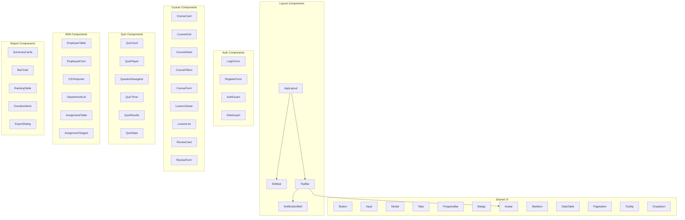
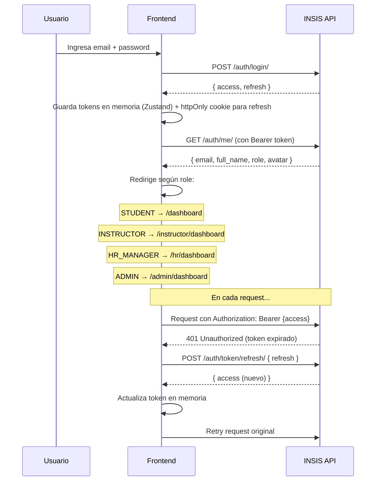

# 🎨 Propuesta de Frontend — INSIS Platform

> Diseño completo de la interfaz web que consume **todos** los servicios del backend INSIS API.

---

## Visión General

La plataforma INSIS necesita un frontend que atienda **5 perfiles de usuario** distintos, cada uno con su propia experiencia optimizada. El diseño propuesto es un **SPA con dark theme premium**, glassmorphism y micro-animaciones.



---

## Stack Tecnológico Propuesto

| Tecnología | Versión | Justificación |
|---|---|---|
| **Next.js** | 15 | SSR para SEO en catálogo público, App Router, API routes para proxy |
| **TypeScript** | 5.x | Type-safety con los responses de DRF |
| **Tailwind CSS** | 4.x | Consistencia en dark theme, responsive rápido |
| **Zustand** | 5.x | State management ligero para auth + UI state |
| **TanStack Query** | 5.x | Cache de API, invalidación automática, optimistic updates |
| **Recharts** | 2.x | Gráficos en dashboards y reportes |
| **React Hook Form** | 7.x | Formularios validados (registro, login, crear cursos) |
| **Framer Motion** | 11.x | Animaciones y transiciones premium |
| **Lucide Icons** | latest | Iconografía consistente |

> [!IMPORTANT]
> **Alternativa simplificada**: Si prefieres evitar Next.js, podemos usar **Vite + React** puro. Perderíamos SSR en el catálogo público pero sería más simple de configurar. ¿Cuál prefieres?

---

## Mockups de Referencia

### 1. Dashboard del Estudiante


### 2. Catálogo de Cursos


### 3. Dashboard HR Manager (B2B)


### 4. Interfaz de Quiz


---

## Mapa de Páginas por Rol

### 🌐 Portal Público (sin auth)

| Ruta | Página | Endpoints consumidos |
|---|---|---|
| `/` | **Landing Page** — Hero con CTA, stats de la plataforma, cursos populares | `GET /courses/` |
| `/courses` | **Catálogo de Cursos** — Grid con filtros, búsqueda, paginación | `GET /courses/` con query params |
| `/courses/:slug` | **Detalle del Curso** — Info, lecciones (preview), reviews, instructor, stats | `GET /courses/{slug}/`, `GET /courses/{slug}/reviews/` |
| `/login` | **Login** — Email + password | `POST /auth/login/` |
| `/register` | **Registro** — Formulario de registro | `POST /auth/register/` |

---

### 🎓 Portal Estudiante

| Ruta | Página | Endpoints consumidos |
|---|---|---|
| `/dashboard` | **Dashboard** — Welcome card, stats, cursos en progreso, quiz recientes | `GET /auth/me/`, `GET /enrollments/`, `GET /quizzes/{id}/attempts/` |
| `/my-learning` | **Mis Cursos** — Grid de cursos inscritos con % progreso | `GET /enrollments/` |
| `/my-learning/:id` | **Detalle Inscripción** — Progreso por lección, marcar completada | `GET /enrollments/{id}/`, `GET /enrollments/{id}/progress/`, `POST /enrollments/{id}/complete-lesson/` |
| `/my-learning/:id/lesson/:lessonId` | **Visor de Lección** — Contenido, video, botón completar | `GET /courses/{slug}/lessons/`, `POST /enrollments/{id}/complete-lesson/` |
| `/courses/:slug/enroll` | **Confirmar Inscripción** | `POST /enrollments/` |
| `/courses/:slug/review` | **Dejar Reseña** | `POST /courses/{slug}/reviews/` |
| `/quizzes/:id` | **Detalle Quiz** — Info, preguntas, intentos previos | `GET /quizzes/{id}/`, `GET /quizzes/{id}/attempts/` |
| `/quizzes/:id/take` | **Tomar Quiz** — Timer, preguntas, opciones, navigator | `POST /quizzes/{id}/start/`, `POST /quizzes/{id}/submit/` |
| `/quizzes/:id/results/:attemptId` | **Resultado Quiz** — Score, pregunta por pregunta | `GET /quizzes/{id}/results/{attempt_id}/` |
| `/certificates` | **Mis Certificados** | `GET /enrollments/my-certificates/` |
| `/profile` | **Mi Perfil** — Editar datos, avatar, contraseña | `GET /auth/me/`, `PATCH /auth/me/`, `POST /auth/change-password/` |

---

### 👨‍🏫 Portal Instructor

| Ruta | Página | Endpoints consumidos |
|---|---|---|
| `/instructor/dashboard` | **Dashboard** — Mis cursos, total inscritos, rating promedio | `GET /courses/` (filtrado por instructor) |
| `/instructor/courses` | **Gestión de Cursos** — Tabla con acciones CRUD | `GET /courses/`, `POST /courses/`, `PATCH /courses/{slug}/`, `DELETE /courses/{slug}/` |
| `/instructor/courses/:slug/edit` | **Editor de Curso** — Formulario completo con preview | `PATCH /courses/{slug}/` |
| `/instructor/courses/:slug/lessons` | **Gestión de Lecciones** — Drag & drop para reordenar | `GET /courses/{slug}/lessons/`, `POST /courses/{slug}/lessons/`, `PATCH /courses/{slug}/lessons/{id}/` |
| `/instructor/courses/:slug/quizzes` | **Gestión de Quizzes** — CRUD de quizzes y preguntas | `GET /courses/{slug}/quizzes/`, `POST /quizzes/`, `GET /quizzes/{id}/questions/`, `POST /quizzes/{id}/questions/` |
| `/instructor/quizzes/:id/stats` | **Estadísticas de Quiz** — Gráficos de rendimiento | `GET /quizzes/{id}/stats/` |

---

### 🏢 Portal HR Manager (B2B)

| Ruta | Página | Endpoints consumidos |
|---|---|---|
| `/hr/dashboard` | **Dashboard Corporativo** — Stats, gráficos, alerts de vencidos | `GET /companies/{id}/stats/`, `GET /reports/company-summary/`, `GET /reports/completion-by-department/`, `GET /reports/overdue-assignments/` |
| `/hr/employees` | **Gestión de Empleados** — Tabla con filtros, búsqueda | `GET /employees/`, `POST /employees/`, `PATCH /employees/{id}/` |
| `/hr/employees/import` | **Import CSV** — Drag & drop de archivo CSV | `POST /employees/bulk-import/` |
| `/hr/employees/:id` | **Perfil Empleado** — Cursos asignados, progreso | `GET /employees/{id}/` |
| `/hr/departments` | **Departamentos** — CRUD | `GET /companies/{id}/departments/`, `POST /companies/{id}/departments/` |
| `/hr/assignments` | **Asignaciones** — Lista con % completado | `GET /assignments/`, `POST /assignments/`, `DELETE /assignments/{id}/` |
| `/hr/assignments/:id` | **Detalle Asignación** — Targets con progreso individual | `GET /assignments/{id}/`, `GET /assignments/{id}/targets/` |
| `/hr/assignments/:id/assign-dept` | **Asignar a Departamento** | `POST /assignments/{id}/assign-department/` |
| `/hr/reports` | **Reportes** — 4 tipos de reportes con visualización | `GET /reports/company-summary/`, `GET /reports/completion-by-department/`, `GET /reports/employee-ranking/`, `GET /reports/overdue-assignments/` |
| `/hr/reports/export` | **Exportar Reportes** — Crear job, ver status, descargar | `POST /reports/exports/`, `GET /reports/exports/{id}/` |

---

### ⚙️ Portal Admin

| Ruta | Página | Endpoints consumidos |
|---|---|---|
| `/admin/dashboard` | **Dashboard Global** — Stats de toda la plataforma | Todos los endpoints de reports + stats |
| `/admin/users` | **Gestión de Usuarios** — Tabla con roles | `GET /auth/me/` (+ admin endpoint si se agrega) |
| `/admin/companies` | **Gestión de Empresas** — CRUD completo | `GET /companies/`, `POST /companies/`, `PATCH /companies/{id}/`, `DELETE /companies/{id}/` |
| `/admin/courses` | **Todos los Cursos** — Vista global con acciones | `GET /courses/` (sin filtro published) |
| `/admin/categories` | **Categorías y Tags** | `GET /categories/`, `POST /categories/`, `GET /tags/`, `POST /tags/` |

---

## Arquitectura de Componentes



---

## Flujo de Autenticación



---

## Service Layer (API Client)

```
src/
├── services/
│   ├── api.ts              # Axios instance con interceptors JWT
│   ├── auth.service.ts     # register, login, logout, me, changePassword
│   ├── courses.service.ts  # CRUD cursos, lecciones, reviews, quizzes
│   ├── enrollments.service.ts  # inscribir, listar, completeLesson, progress, certificates
│   ├── quizzes.service.ts  # detail, start, submit, attempts, results, stats
│   ├── companies.service.ts    # CRUD companies, departments, stats
│   ├── employees.service.ts    # CRUD employees, bulkImport
│   ├── assignments.service.ts  # CRUD assignments, assignDepartment, targets
│   └── reports.service.ts      # summaries, export jobs
├── hooks/
│   ├── useAuth.ts          # login, logout, usuario actual
│   ├── useCourses.ts       # useQuery + useMutation wrappers
│   ├── useEnrollments.ts
│   ├── useQuizzes.ts
│   ├── useCompanies.ts
│   └── useReports.ts
└── types/
    ├── user.ts             # User, UserProfile, Roles enum
    ├── course.ts           # Course, Lesson, Category, Tag, Review
    ├── enrollment.ts       # Enrollment, LessonProgress
    ├── quiz.ts             # Quiz, Question, Option, Attempt
    ├── company.ts          # Company, Department, Employee
    ├── assignment.ts       # CourseAssignment, AssignmentTarget, CompletionRecord
    └── report.ts           # ReportExportJob, report data shapes
```

---

## Design System

### Paleta de Colores

| Token | Valor | Uso |
|---|---|---|
| `--bg-primary` | `#0F172A` | Fondo principal |
| `--bg-card` | `#1E293B` | Tarjetas y paneles |
| `--bg-elevated` | `#334155` | Elementos elevados |
| `--accent-purple` | `#8B5CF6` | CTAs principales, links activos |
| `--accent-blue` | `#3B82F6` | Información, progreso |
| `--accent-emerald` | `#10B981` | Éxito, completado |
| `--accent-amber` | `#F59E0B` | Advertencias |
| `--accent-red` | `#EF4444` | Errores, vencidos |
| `--text-primary` | `#F8FAFC` | Texto principal |
| `--text-secondary` | `#94A3B8` | Texto secundario |
| `--border` | `#334155` | Bordes sutiles |

### Tipografía
- **Headings**: Inter Bold (700)
- **Body**: Inter Regular (400) / Medium (500)
- **Mono**: JetBrains Mono (para código en lecciones)

### Espaciado y Grid
- Grid de 12 columnas con `gap: 24px`
- Sidebar: `280px` colapsable a `72px`
- Border radius: `12px` (cards), `8px` (inputs), `full` (avatars/badges)

---

## Mapeo Completo: Endpoint → Componente UI

| Endpoint | Método | Componente Frontend | Página |
|---|---|---|---|
| `/auth/register/` | POST | `RegisterForm` | `/register` |
| `/auth/login/` | POST | `LoginForm` | `/login` |
| `/auth/token/refresh/` | POST | `api.ts` interceptor | automático |
| `/auth/logout/` | POST | `TopBar` → logout button | todas |
| `/auth/me/` | GET | `useAuth` hook | todas |
| `/auth/me/` | PATCH | `ProfileForm` | `/profile` |
| `/auth/change-password/` | POST | `ChangePasswordForm` | `/profile` |
| `/courses/` | GET | `CourseGrid` + `CourseFilters` | `/courses` |
| `/courses/` | POST | `CourseForm` (modal) | `/instructor/courses` |
| `/courses/{slug}/` | GET | `CourseDetail` | `/courses/:slug` |
| `/courses/{slug}/` | PATCH | `CourseForm` (edit mode) | `/instructor/courses/:slug/edit` |
| `/courses/{slug}/` | DELETE | `ConfirmModal` | `/admin/courses` |
| `/courses/{slug}/lessons/` | GET | `LessonList` | `/courses/:slug`, `/instructor/...` |
| `/courses/{slug}/lessons/` | POST | `LessonForm` | `/instructor/courses/:slug/lessons` |
| `/courses/{slug}/lessons/{id}/` | PATCH | `LessonForm` (edit) | `/instructor/courses/:slug/lessons` |
| `/courses/{slug}/reviews/` | GET | `ReviewCard` list | `/courses/:slug` |
| `/courses/{slug}/reviews/` | POST | `ReviewForm` | `/courses/:slug/review` |
| `/courses/{slug}/quizzes/` | GET | `QuizCard` list | `/courses/:slug` |
| `/enrollments/` | GET | `EnrollmentCard` grid | `/my-learning` |
| `/enrollments/` | POST | `EnrollButton` | `/courses/:slug` |
| `/enrollments/{id}/` | GET | `EnrollmentDetail` | `/my-learning/:id` |
| `/enrollments/{id}/complete-lesson/` | POST | `LessonViewer` → complete btn | `/my-learning/:id/lesson/:lid` |
| `/enrollments/{id}/progress/` | GET | `ProgressTracker` | `/my-learning/:id` |
| `/enrollments/{id}/` | DELETE | `CancelEnrollment` modal | `/my-learning/:id` |
| `/enrollments/my-certificates/` | GET | `CertificateCard` grid | `/certificates` |
| `/quizzes/{id}/` | GET | `QuizDetail` | `/quizzes/:id` |
| `/quizzes/{id}/start/` | POST | `QuizPlayer` | `/quizzes/:id/take` |
| `/quizzes/{id}/submit/` | POST | `QuizPlayer` → submit | `/quizzes/:id/take` |
| `/quizzes/{id}/attempts/` | GET | `AttemptList` | `/quizzes/:id` |
| `/quizzes/{id}/results/{aid}/` | GET | `QuizResults` | `/quizzes/:id/results/:aid` |
| `/quizzes/{id}/stats/` | GET | `QuizStats` charts | `/instructor/quizzes/:id/stats` |
| `/quizzes/` | POST | `QuizForm` | `/instructor/courses/:slug/quizzes` |
| `/companies/` | GET/POST | `CompanyTable` + `CompanyForm` | `/admin/companies` |
| `/companies/{id}/` | GET | `CompanyDetail` | `/hr/dashboard` |
| `/companies/{id}/departments/` | GET/POST | `DepartmentList` + form | `/hr/departments` |
| `/companies/{id}/stats/` | GET | `SummaryCards` | `/hr/dashboard` |
| `/employees/` | GET | `EmployeeTable` | `/hr/employees` |
| `/employees/` | POST | `EmployeeForm` | `/hr/employees` |
| `/employees/bulk-import/` | POST | `CSVImporter` | `/hr/employees/import` |
| `/employees/{id}/` | GET/PATCH | `EmployeeDetail` + form | `/hr/employees/:id` |
| `/assignments/` | GET/POST | `AssignmentTable` + form | `/hr/assignments` |
| `/assignments/{id}/` | GET/DELETE | `AssignmentDetail` | `/hr/assignments/:id` |
| `/assignments/{id}/assign-department/` | POST | `AssignDeptModal` | `/hr/assignments/:id` |
| `/assignments/{id}/targets/` | GET | `AssignmentTargets` table | `/hr/assignments/:id` |
| `/reports/company-summary/` | GET | `SummaryCards` | `/hr/reports` |
| `/reports/completion-by-department/` | GET | `BarChart` | `/hr/reports` |
| `/reports/employee-ranking/` | GET | `RankingTable` | `/hr/reports` |
| `/reports/overdue-assignments/` | GET | `OverdueAlerts` | `/hr/reports` |
| `/reports/exports/` | POST | `ExportDialog` | `/hr/reports/export` |
| `/reports/exports/{id}/` | GET | `ExportStatus` polling | `/hr/reports/export` |

---

## Open Questions

> [!IMPORTANT]
> **¿Dónde se va a hostear el frontend?**
> - Vercel (ideal para Next.js)
> - Cloud Run (junto con el backend)
> - Netlify
> - ¿Otro?

> [!IMPORTANT]
> **¿Framework de preferencia?**
> - **Next.js 15** (SSR, SEO, más complejo) → recomendado si el catálogo público importa para SEO
> - **Vite + React** (SPA puro, más simple) → recomendado si el frontend es solo para usuarios autenticados
> - **¿Algún otro framework que prefieras?**

> [!WARNING]
> **¿El frontend debe manejar pagos?**
> El modelo `Course` tiene campo `price` pero no hay endpoint de pagos en el API. Si se necesita, habría que integrar Stripe/MercadoPago en el frontend y agregar endpoints al backend.

> [!NOTE]
> **Scope del MVP**: ¿Quieres que construyamos todas las 25+ páginas de una vez, o prefieres empezar con un MVP más pequeño? Mi recomendación es empezar con:
> 1. Auth (login/register)
> 2. Catálogo público de cursos
> 3. Dashboard del estudiante + my-learning
> 4. Quiz player
>
> Y luego iterar con los módulos B2B (HR, reportes, asignaciones).

---

## Resumen de Cobertura

| Módulo API | Endpoints | Páginas Frontend | Componentes |
|---|---|---|---|
| Auth | 7 | 3 | 4 |
| Courses | 10 | 5 | 8 |
| Enrollments | 7 | 4 | 5 |
| Quizzes | 8 | 4 | 6 |
| Companies | 5 | 3 | 3 |
| Employees | 5 | 3 | 4 |
| Assignments | 5 | 3 | 3 |
| Reports | 6 | 2 | 5 |
| **Total** | **53** | **27** | **38** |

✅ **100% de los endpoints del API están cubiertos** en el diseño del frontend.
